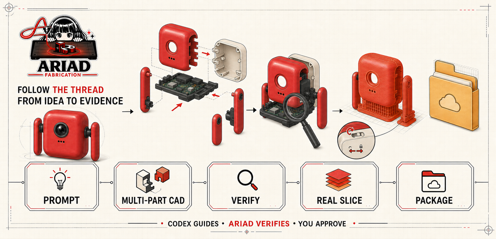
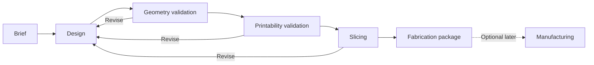

# Ariad Fabrication


**Ariad Fabrication**, shortened to **Ariad**, is a local-first visual fabrication workspace for Codex. A locally authenticated Codex agent converses with the user while Ariad supplies constrained tools that turn confirmed requirements into editable parametric CAD, validate geometry and printability, slice against real printer profiles, and produce an auditable fabrication package.

The project is being built as a long-term developer tool. A hackathon submission may be a checkpoint, but deadlines do not define the architecture or the evidence standard.

## Judge quickstart — Windows 11 x64

Ariad is entered in **Developer Tools**. The fastest judge path uses committed fixture evidence plus any valid real R4 revision already present locally; it never connects to hardware.

Requirements: Python 3.11, [uv](https://docs.astral.sh/uv/), Node.js 20.19 or newer, and pnpm 11.9.0.

```powershell
uv sync --frozen --extra test --extra cad
pnpm --dir web install --frozen-lockfile
.\scripts\start_demo.ps1 -Evidence showcase
```

Open the printed loopback URL, then use **Build session**. For fresh prompt-to-CAD generation, start the demo with your locally authenticated native Codex executable:

```powershell
.\scripts\start_demo.ps1 -Evidence showcase -CodexBin "C:\path\to\codex.exe"
```

Describe a hard-surface object such as a phone stand. Codex proposes a new closed declarative CSG document; Ariad validates it and deterministically generates exact assembly/per-part STEP, per-part STL, and a GLB preview. The model can contain up to eight separate parts and can be revised with another plain-language instruction. The **live L-bracket** remains a deterministic family test, while the robot remains the richer prepared reference through confirmed Brief → components → blueprint → multi-part CAD → Verify → real reference slicing → Package. Return to **Technical evidence** for committed success/failure fixtures and locally available real R4 model/toolpath evidence. PrusaSlicer is needed only to regenerate sliced R4 evidence; both live CAD paths require the pinned CAD extra installed above.

Supported submission platform: Windows 11 x64. Hardware, physical validation, and arbitrary generated-code execution remain deliberately unavailable. General generation is a bounded best-effort hard-surface CSG path, not a promise that every imaginable or organic prompt becomes printable. See the [two-minute-fifty-second runbook](docs/DEMO_RUNBOOK.md) and [submission readiness matrix](docs/HACKATHON.md).

The robot demo uses a Raspberry Pi Zero 2 W and two Feetech SCS0009 manufacturer envelopes, a supplier-dependent camera reservation, and external regulated power; Rev A deliberately contains no battery. It also includes a separately downloadable six-part clearance-and-snap coupon as the recommended first future print. No component fit or durability result is claimed until real parts and a printer/material/process combination are measured.

The image above is the official project logo. The illustration below explains the current product story and is not a substitute logo.



## Product contract

Ariad should help a beginner move from an idea to a manufacturing-ready package without hiding engineering decisions. Its guiding line is **follow the thread from idea to evidence**. The normal flow is:

```text
Describe -> Clarify -> Design -> Validate -> Slice -> Package -> Manufacture later
```

The system may assist with requirements, CAD planning, and repair. It must not treat model confidence as proof. Geometry checks, printability checks, a real slicer, and eventually physical measurements provide the evidence.

Ariad is not positioned as the first prompt-to-print agent. Its primary product is the inspectable evidence chain for functional parts: explicit requirements, editable B-rep CAD, deterministic findings, profile-specific slicing evidence, and honest claim boundaries. Printer operation remains optional and later.

The first reference application is **OpenGrow**: modular planting and robotics parts such as stake clamps, sensor enclosures, pump mounts, cable guides, motor brackets, and chassis components.

## Current status

This repository contains an early Python prototype, not a production pipeline.

| Area | Current evidence |
|---|---|
| Codex agent | The app-server handshake, sanitized status, authenticated loopback conversation routes, bounded text/tool events, cancellation, and React chat are implemented. Five non-mutating tools cover idea capture, evidence reads, R0-bound Design-plan proposals, and closed declarative-CAD proposals. The CAD proposal is ephemeral data; it cannot persist a plan, execute code, slice, or contact hardware |
| Projects | A user can save an intent, clarify visible unknowns, approve a complete PartSpec into a checksum-bound R0 Journey, persist an R0-bound Design plan, and ask Codex for a new R0-bound declarative CAD proposal. Ariad interprets that validated proposal only after the user's build approval |
| Intent intake | Universal bounded prompt capture and a strict GPT-5.6 proposal decoder exist; no direct model call is configured |
| Orchestration | The Golden Part path records Brief R0 through Slicing/Package R4 with immutable revisions, stage runs, events, findings, and artifact lineage |
| CAD generation | The registered Golden Part provider creates exact evidence artifacts. Separately, the browser can execute the deterministic seven-parameter L-bracket or ask Codex for a bounded multi-part CSG proposal. Ariad's deterministic interpreter emits fresh STEP, STL, GLB, content identities, and one-solid/kernel checks without granting Journey R1/R2 evidence |
| Geometry validation | The re-imported STEP passes 25 frozen OCCT feature, clearance, and dimensional checks; compatibility STL also passes a closed two-manifold edge check |
| Printability validation | The centered Z-up STEP passes 23 deterministic checks for the exact generic printer/PETG/process/orientation bundle and retains five physical unknowns as warnings |
| Slicing | The Golden Part's real PrusaSlicer 2.9.6 run produces a profile-bearing 3MF project and G-code with zero reported mesh repairs or slicer warnings |
| G-code validation | Profile-specific disconnected preflight checks units, modes, bounds, temperatures, tools, support features, layer height, and forbidden commands before R4 |
| Fabrication package | One reproducible printer-independent revision contains 36 checksummed artifacts and an explicit R4 claim boundary |
| User interface | M4-M provides the read-only journey shell, six deterministic fixtures including a parent/child revision pair, work-bounded revision discovery and pagination, bounded persisted-record and verified-artifact snapshots, strict lifecycle/scalar/timestamp/root/report/profile/schema/lineage/package/content-identity validation, interactive GLB preview, worker-isolated real G-code layer playback, generated API types, a selectable persisted-evidence explorer, bounded server-owned revision comparison, and tested keyboard/contrast/reduced-motion foundations |
| Execution control | M4-N freezes the no-hardware contract; M4-O implements its transactional SQLite store; M4-P seals R2/R4 target identity. The registered lane launch-reverifies identity, enforces exact Python imports, suppresses command-shell probing, supervises CAD plus all three PrusaSlicer commands, and coordinates leases, cancellation, persisted Journey snapshots, and transactional event projection. Real runs reach R2 (15 artifacts) and R4 (36 artifacts). Filesystem/network OS isolation, authenticated mutation/SSE, and browser Run remain unavailable. |
| Printer control | Outside the evidence path; no printer is selected, connected, uploaded to, or authorized |
| Physical validation | Not started |

Do not describe the current output as physically proven or reliably printable. See [Reliability](docs/RELIABILITY.md) for the allowed evidence language.

## Locked direction

- Functional parts use parametric boundary-representation CAD, with CadQuery/OCCT as the first implementation path.
- Organic or decorative mesh generation is a separate, later lane; Blender can support cleanup, inspection, and rendering.
- Python owns the CAD, validation, slicer, and read-only application boundaries. React/TypeScript owns the browser interface. Go remains optional for a future control-plane or printer-side service.
- The product is printer-agnostic and works without owning hardware.
- STEP is the editable geometry interchange, 3MF is the manufacturing package, GLB is the browser preview, and STL is compatibility output.
- A real slicer produces G-code. An LLM never authors final G-code directly.
- Human approval is required before any future action that heats or moves physical hardware.

The complete rationale is recorded in [Decisions](docs/DECISIONS.md).

## Fabrication Journey

The primary user experience is an inspectable, shipment-style journey. Each stage records its inputs, events, findings, decisions, artifacts, and exit evidence.



This is a real execution trace, not a decorative progress animation. See [Architecture](docs/ARCHITECTURE.md) and [Product](docs/PRODUCT.md).

## Milestone status

M1, M2, and M3 are complete. The deterministic Golden Part path now:

1. Reproduces a pinned CPython 3.11, CadQuery 2.8.0, and cadquery-ocp 7.9.3.1.1 environment from `uv.lock`.
2. Builds the frozen OpenGrow stake electronics clamp from inspectable parameters and copied editable source.
3. Canonicalizes STEP and 3MF exporter metadata, re-imports STEP as one valid solid, and proves repeated design-artifact hashes are identical.
4. Checks the body, envelope, bore, stake clearance, wall, split, mounting interface, M3 holes and spacing, cable channel, and transition fillets through 25 deterministic OCCT checks.
5. Materializes the accepted Z-up orientation and checks build-volume margins, exact bed contact, nozzle-relative walls/features, layer-height ratio, overhangs, bounded bridges, disabled-support policy, bore direction, and first-layer clearance through 23 frozen R3 checks.
6. Snapshots a generic uncalibrated 0.4 mm/PETG/0.20 mm/30% infill profile bundle and preserves five physical unknowns as warnings rather than passes.
7. Runs the approved PrusaSlicer 2.9.6 console, records every command/log/profile/checksum, applies disconnected G-code preflight and a fail-closed warning/repair policy, and assembles 36 real artifacts into an R4 package.

The active milestone is **M4 - Fabrication Journey interface**. M4-M can list and inspect real persisted R2/R4 revisions, orbit the actual GLB preview, replay the actual linear G-code moves by layer off the UI thread, and demonstrate complete, `needs_input`, failed Geometry, failed Printability, incomplete Package, and parent-to-child revision states with explicitly non-evidentiary fixtures. The generated API 1.7.0 contract carries bounded, checksum-verified evidence into a selectable explorer, computes bounded semantic diffs, serves artifacts from the exact verified byte snapshot, and caps each revision-list request at 5,000 examined directory entries, 500 observed candidates, and 200 loaded summaries. The browser exposes observed/returned/omitted counts, truncation reasons, and the fact that live offset pages are not snapshot-consistent. Root records, inspection sources, and artifacts share allocation-capped reads; duplicate JSON keys, non-finite constants, excessive depth/nodes, and scalar coercion fail closed. Nineteen allowlisted Draft 2020-12 evidence contracts cover PartSpec, relevant StageEvent, ArtifactManifest, production/fixture packages, and separate production/fixture schemas for geometry, printability, preflight, printer, material, process, and orientation values. M4-N adds three separately allowlisted execution-control contracts for requests, records, and events. Report producers validate before publication; replay validates after size/SHA-256; production package IDs, exact/oriented geometry descriptors, preflight, benchmark identity, and packaged PartSpec content must agree with the checksum-verified artifacts. Direct artifact reads repeat applicable semantic checks. Stage-owned record coverage, unique artifact paths, parent existence/acyclic chronology, successful Package-stage ownership, the exact 19-role package subset, package/manifest descriptors, unresolved warnings, package-report bytes, and G-code summary metadata must also agree before presentation. Journey text remains JSON strings, inspection numerics remain JSON numbers, and all ten exposed timestamp fields are timezone-aware date-time contracts backed by job/revision/stage/event/approval/manifest chronology checks. Unsupported inspection shapes become unavailable rather than plausible passes. Comparison omits volatile IDs and timestamps, runs on the server, and neither reruns stages nor proves equivalence. M4-M adds skip navigation, route titles and focus transfer, ordered headings, keyboard-operated inspection tabs, non-actionable unavailable artifacts, textual check results, distinct toolpath line styles, live reduced-motion handling, tested color contrast, and a React-safe Three.js mount. M4-N freezes canonical request hashing, immutable R2/R4 plan identities, idempotent replay/conflict behavior, bounded FIFO admission, terminal/cancellation race rules, fenced leases, crash interruption, event limits, resource ceilings, and non-manufacturing failure vocabulary. M4-O implements those persistence semantics in a WAL/FULL SQLite control store with strict tables, schema fingerprints, canonical checksums, database guards, one terminal-event reserve, concurrent-open handling, and replay validation. M4-P implements the closed target resolver and admission coordinator: a caller chooses only R2 or R4, while Ariad verifies fixed benchmark/profile assets, its source/schema bundle, the exact CPython and traced dependency trees, the active Windows host identity, and—for R4—the approved PrusaSlicer archive and all 1,119 installed files before persisting an immutable plan. The registry is internal and checkout-local; it launches no process and contacts no hardware. Event transport, browser-triggered execution, the cancellable policy adapter, assistive-technology testing, and screenshot-level browser QA remain incomplete. R4 is still a digital, profile-specific result: physical adhesion, accuracy, stake fit, strength, weathering, food safety, and print success remain unproven.

Current automated verification covers confirmed project intent, clarification, explicit R0 Brief persistence, R0-bound Design planning, the five-tool non-mutating Codex runtime, declarative-CAD contract rejection, deterministic CSG interpretation, evidence integrity, sealed execution boundaries, assembly contracts, live bounded L-bracket generation, and real sealed R2/R4 integrations. API 1.21.0 exposes the authenticated general proposal/generation path alongside the robot reference and L-bracket family. Frontend verification includes OpenAPI/generated-type drift, TypeScript, lint, a fresh general-prompt build test, optional real-artifact checks, and a production build. Physical testing remains outstanding.

## Repository map

```text
.
|-- README.md                 Stable project entry point
|-- NOW.md                    Current milestone, next actions, and blockers
|-- AGENTS.md                 Durable repository rules for coding agents
|-- assets/                   Approved visual identity and project-story artwork
|-- .github/workflows/        Lightweight backend and frontend verification
|-- docs/
|   |-- PRODUCT.md            Users, value proposition, principles, and boundaries
|   |-- ARCHITECTURE.md       Target system, stages, records, artifacts, and stack
|   |-- EXECUTION.md          Frozen no-hardware runner, event, cancellation, and resource contract
|   |-- RELIABILITY.md        Evidence levels, gates, tests, and claim language
|   |-- ROADMAP.md            Milestones and exit criteria; no deadline schedule
|   |-- DECISIONS.md          Accepted and deferred architecture decisions
|   `-- RESEARCH.md           Curated references and procurement watchlist
|-- schemas/v1/              Versioned domain, manufacturing, and interface-API contracts
|-- benchmarks/
|   |-- golden_part/         Frozen functional benchmark and expected measurements
|   |-- 3dbenchy/            Pinned external CC0 printer-calibration fixture
|   `-- interface/           Deterministic M4 fixture; explicitly not fabrication evidence
|-- profiles/v1/             Versioned printer, material, process, orientation, and slicer profiles
|-- scripts/                 Deterministic toolchain-manifest generators
|-- toolchains/v1/           Committed CAD-runtime and PrusaSlicer content manifests; no binaries
|-- experiments/             Isolated concept work that earns no pipeline evidence
|-- src/ariad_fabrication/   Current Python prototype
|   |-- domain/               Immutable specification and journey records
|   |-- execution/            No-hardware contracts, trusted target registry, admission, and control store
|   |-- cad/                  Optional worker, Golden Part source, exports, and checks
|   |-- slicing/              Real CLI adapter, profile contracts, and G-code preflight
|   `-- api/                  Loopback-only read API, OpenAPI snapshot, and fixture generator
|-- tests/                    Current deterministic tests
|-- web/                      Vite React/TypeScript Fabrication Journey client
`-- pyproject.toml            Python package metadata
```

Experiments are deliberately outside Golden Part qualification. The real-slicer comparison supplies adapter compatibility evidence only; its reports preserve warnings and do not advance the Golden Part or claim physical success.

## Local prototype

The Brief-only path remains lightweight. The CAD path is an optional, pinned environment of approximately 1 GiB because OCCT and visualization binaries are included.

```powershell
uv sync --extra test --extra cad
.\.venv\Scripts\python.exe -m unittest discover -s tests
.\.venv\Scripts\python.exe -m ariad_fabrication.cli --golden-part --runs-root runs
```

The Golden Part command creates a unique ignored directory under `runs/`, executes the registered CAD worker, deterministic R3 validator, approved disconnected slicer, and package gate, then prints the revision, manifest, and achieved evidence levels. With the pinned PrusaSlicer console available, it should end at `completed` / R4 without contacting hardware. Pass `--slicer-executable <path>` or set `ARIAD_PRUSASLICER` when the executable is outside the documented `runs/tools` location.

To stop after exact digital geometry evidence, use:

```powershell
.\.venv\Scripts\python.exe -m ariad_fabrication.cli --golden-part-r2 --runs-root runs
```

The original intake smoke test is still available:

```powershell
.\.venv\Scripts\python.exe -m ariad_fabrication.cli --confirm "Create a 40 x 20 x 5 mm mounting bracket in PETG with tolerance 0.2 mm without supports"
```

That command reaches R0 only. Omitting a critical fact produces `needs_input` instead of silently inventing a value.

To inspect existing local runs through the M4 interface, start the API and web client in separate terminals:

```powershell
.\.venv\Scripts\ariad-interface-api.exe --runs-root runs
pnpm --dir web install --frozen-lockfile
pnpm --dir web dev
```

For the hackathon walkthrough, `scripts/start_demo.ps1` now defaults to a curated `showcase` workspace: it copies one valid local real R4 revision when available, adds the six explicitly non-evidentiary interface fixtures, and omits duplicate or invalid development runs. See [Demo runbook](docs/DEMO_RUNBOOK.md). Hardware remains disconnected and browser execution remains unavailable.

For a compact interface-only demonstration, replace `runs` with `benchmarks/interface`. That fixture family is prominently labelled, includes a parent/child pair for revision comparison, and cannot provide fabrication evidence. The API binds to loopback; its durable user mutations are confirmed project intents, nullable clarification drafts, explicit PartSpec approval into R0, and an R0-bound planning-only Design plan. Authenticated browser CAD is limited to the deterministic L-bracket and validated declarative-data interpreter; sealed R2/R4 execution, slicing of general models, generated-code execution, and all hardware actions remain unavailable.

## Documentation index

- [Product and principles](docs/PRODUCT.md)
- [Concept model-sheet visual guide](docs/MODEL_SHEET_GUIDE.md)
- [Architecture](docs/ARCHITECTURE.md)
- [No-hardware execution contract](docs/EXECUTION.md)
- [Reliability and validation](docs/RELIABILITY.md)
- [Roadmap](docs/ROADMAP.md)
- [Decision log](docs/DECISIONS.md)
- [Research and references](docs/RESEARCH.md)
- [Hackathon submission workspace](docs/HACKATHON.md)
- [Submission factual worksheet](docs/SUBMISSION_FACTS.md)
- [Hackathon demo runbook](docs/DEMO_RUNBOOK.md)
- [Visual assets and provenance](assets/README.md)
- [Current work](NOW.md)

## Project rule

When documentation and implementation disagree, the implementation determines what currently exists, while [Decisions](docs/DECISIONS.md) determines the intended direction. Update the status documents in the same change that alters either one.
