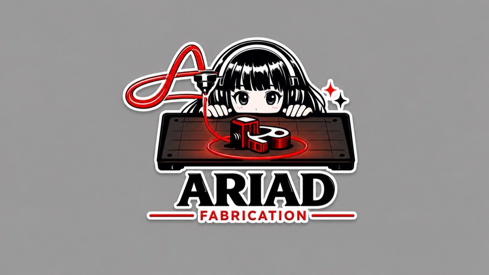
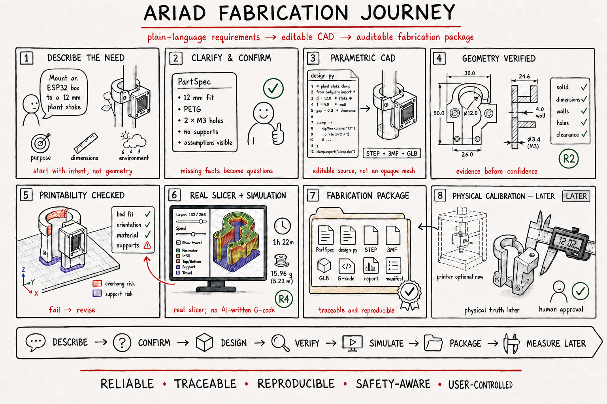
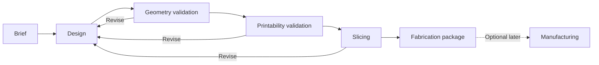

# Ariad Fabrication



**Ariad Fabrication**, shortened to **Ariad**, is a local-first, calibration-aware fabrication system that turns plain-language requirements into editable parametric CAD, validates geometry and printability, slices against real printer profiles, and produces an auditable fabrication package.

The project is being built as a long-term developer tool. A hackathon submission may be a checkpoint, but deadlines do not define the architecture or the evidence standard.

The image above is the official project logo. The illustration below explains the current product story and is not a substitute logo.



## Product contract

Ariad should help a beginner move from an idea to a manufacturing-ready package without hiding engineering decisions. Its guiding line is **follow the thread from idea to evidence**. The normal flow is:

```text
Describe -> Clarify -> Design -> Validate -> Slice -> Package -> Manufacture later
```

The system may assist with requirements, CAD planning, and repair. It must not treat model confidence as proof. Geometry checks, printability checks, a real slicer, and eventually physical measurements provide the evidence.

Ariad is not positioned as the first prompt-to-print agent. Its primary product is the inspectable evidence chain for functional parts: explicit requirements, editable B-rep CAD, deterministic findings, profile-specific slicing evidence, and honest claim boundaries. Printer operation remains optional and later.

The first reference application is **OpenGrow**: modular planting and robotics parts such as stake clamps, sensor enclosures, pump mounts, cable guides, motor brackets, and chassis components.

## Current status

This repository contains an early Python prototype, not a production pipeline.

| Area | Current evidence |
|---|---|
| Intent intake | Rule-based parser and an SDK-independent OpenAI adapter exist |
| Orchestration | The Golden Part path records Brief R0 through Slicing/Package R4 with immutable revisions, stage runs, events, findings, and artifact lineage |
| CAD generation | One registered hand-authored CadQuery provider creates editable parametric source, one valid solid, exact STEP, 3MF geometry, GLB preview, and compatibility STL |
| Geometry validation | The re-imported STEP passes 25 frozen OCCT feature, clearance, and dimensional checks; compatibility STL also passes a closed two-manifold edge check |
| Printability validation | The centered Z-up STEP passes 23 deterministic checks for the exact generic printer/PETG/process/orientation bundle and retains five physical unknowns as warnings |
| Slicing | The Golden Part's real PrusaSlicer 2.9.6 run produces a profile-bearing 3MF project and G-code with zero reported mesh repairs or slicer warnings |
| G-code validation | Profile-specific disconnected preflight checks units, modes, bounds, temperatures, tools, support features, layer height, and forbidden commands before R4 |
| Fabrication package | One reproducible printer-independent revision contains 36 checksummed artifacts and an explicit R4 claim boundary |
| User interface | M4-B provides the read-only journey shell, five deterministic stop-state fixtures, checksum-verified downloads, interactive GLB preview, and worker-isolated real G-code layer playback |
| Printer control | Outside the evidence path; no printer is selected, connected, uploaded to, or authorized |
| Physical validation | Not started |

Do not describe the current output as physically proven or reliably printable. See [Reliability](docs/RELIABILITY.md) for the allowed evidence language.

## Locked direction

- Functional parts use parametric boundary-representation CAD, with CadQuery/OCCT as the first implementation path.
- Organic or decorative mesh generation is a separate, later lane; Blender can support cleanup, inspection, and rendering.
- Python owns the CAD, validation, slicer, and read-only application boundaries. React/TypeScript owns the browser interface. Go remains optional for a future control-plane or printer-side service.
- The product is printer-agnostic and works without owning hardware.
- STEP is the editable geometry interchange, 3MF is the manufacturing package, GLB is the browser preview, and STL is compatibility output.
- A real slicer produces G-code. An LLM never authors final G-code directly.
- Human approval is required before any future action that heats or moves physical hardware.

The complete rationale is recorded in [Decisions](docs/DECISIONS.md).

## Fabrication Journey

The primary user experience is an inspectable, shipment-style journey. Each stage records its inputs, events, findings, decisions, artifacts, and exit evidence.



This is a real execution trace, not a decorative progress animation. See [Architecture](docs/ARCHITECTURE.md) and [Product](docs/PRODUCT.md).

## Milestone status

M1, M2, and M3 are complete. The deterministic Golden Part path now:

1. Reproduces a pinned CPython 3.11, CadQuery 2.8.0, and cadquery-ocp 7.9.3.1.1 environment from `uv.lock`.
2. Builds the frozen OpenGrow stake electronics clamp from inspectable parameters and copied editable source.
3. Canonicalizes STEP and 3MF exporter metadata, re-imports STEP as one valid solid, and proves repeated design-artifact hashes are identical.
4. Checks the body, envelope, bore, stake clearance, wall, split, mounting interface, M3 holes and spacing, cable channel, and transition fillets through 25 deterministic OCCT checks.
5. Materializes the accepted Z-up orientation and checks build-volume margins, exact bed contact, nozzle-relative walls/features, layer-height ratio, overhangs, bounded bridges, disabled-support policy, bore direction, and first-layer clearance through 23 frozen R3 checks.
6. Snapshots a generic uncalibrated 0.4 mm/PETG/0.20 mm/30% infill profile bundle and preserves five physical unknowns as warnings rather than passes.
7. Runs the approved PrusaSlicer 2.9.6 console, records every command/log/profile/checksum, applies disconnected G-code preflight and a fail-closed warning/repair policy, and assembles 36 real artifacts into an R4 package.

The active milestone is **M4 - Fabrication Journey interface**. M4-B can list and inspect real persisted R2/R4 revisions, orbit the actual GLB preview, replay the actual linear G-code moves by layer off the UI thread, and demonstrate complete, `needs_input`, failed Geometry, failed Printability, and incomplete Package states with explicitly non-evidentiary fixtures. OpenAPI/TypeScript drift checking, richer report/feature inspection, revision comparison, event streaming, browser-triggered execution, and screenshot-level browser QA remain incomplete. R4 is still a digital, profile-specific result: physical adhesion, accuracy, stake fit, strength, weathering, food safety, and print success remain unproven.

Current verification passes 65 backend tests in the pinned CAD/slicer environment plus frontend dependency-policy, type-check, lint, four deterministic tests, two real-artifact integration tests, production-build, and live HTTP artifact checks. Automated visual browser QA remains outstanding for the reason recorded in `NOW.md`.

## Repository map

```text
.
|-- README.md                 Stable project entry point
|-- NOW.md                    Current milestone, next actions, and blockers
|-- AGENTS.md                 Durable repository rules for coding agents
|-- assets/                   Approved visual identity and project-story artwork
|-- .github/workflows/        Lightweight backend and frontend verification
|-- docs/
|   |-- PRODUCT.md            Users, value proposition, principles, and boundaries
|   |-- ARCHITECTURE.md       Target system, stages, records, artifacts, and stack
|   |-- RELIABILITY.md        Evidence levels, gates, tests, and claim language
|   |-- ROADMAP.md            Milestones and exit criteria; no deadline schedule
|   |-- DECISIONS.md          Accepted and deferred architecture decisions
|   `-- RESEARCH.md           Curated references and procurement watchlist
|-- schemas/v1/              Versioned domain, printability-report, and package contracts
|-- benchmarks/
|   |-- golden_part/         Frozen functional benchmark and expected measurements
|   |-- 3dbenchy/            Pinned external CC0 printer-calibration fixture
|   `-- interface/           Deterministic M4 fixture; explicitly not fabrication evidence
|-- profiles/v1/             Versioned printer, material, process, orientation, and slicer profiles
|-- experiments/             Isolated concept work that earns no pipeline evidence
|-- src/ariad_fabrication/   Current Python prototype
|   |-- domain/               Immutable specification and journey records
|   |-- cad/                  Optional worker, Golden Part source, exports, and checks
|   |-- slicing/              Real CLI adapter, profile contracts, and G-code preflight
|   `-- api/                  Loopback-only read API and interface-fixture generator
|-- tests/                    Current deterministic tests
|-- web/                      Vite React/TypeScript Fabrication Journey client
`-- pyproject.toml            Python package metadata
```

Experiments are deliberately outside Golden Part qualification. The real-slicer comparison supplies adapter compatibility evidence only; its reports preserve warnings and do not advance the Golden Part or claim physical success.

## Local prototype

The Brief-only path remains lightweight. The CAD path is an optional, pinned environment of approximately 1 GiB because OCCT and visualization binaries are included.

```powershell
uv sync --extra test --extra cad
.\.venv\Scripts\python.exe -m unittest discover -s tests
.\.venv\Scripts\python.exe -m ariad_fabrication.cli --golden-part --runs-root runs
```

The Golden Part command creates a unique ignored directory under `runs/`, executes the registered CAD worker, deterministic R3 validator, approved disconnected slicer, and package gate, then prints the revision, manifest, and achieved evidence levels. With the pinned PrusaSlicer console available, it should end at `completed` / R4 without contacting hardware. Pass `--slicer-executable <path>` or set `ARIAD_PRUSASLICER` when the executable is outside the documented `runs/tools` location.

To stop after exact digital geometry evidence, use:

```powershell
.\.venv\Scripts\python.exe -m ariad_fabrication.cli --golden-part-r2 --runs-root runs
```

The original intake smoke test is still available:

```powershell
.\.venv\Scripts\python.exe -m ariad_fabrication.cli --confirm "Create a 40 x 20 x 5 mm mounting bracket in PETG with tolerance 0.2 mm without supports"
```

That command reaches R0 only. Omitting a critical fact produces `needs_input` instead of silently inventing a value.

To inspect existing local runs through the M4 interface, start the API and web client in separate terminals:

```powershell
.\.venv\Scripts\ariad-interface-api.exe --runs-root runs
pnpm --dir web install --frozen-lockfile
pnpm --dir web dev
```

For a compact interface-only demonstration, replace `runs` with `benchmarks/interface`. That fixture is prominently labelled and cannot provide fabrication evidence. The API binds to loopback and exposes no hardware or mutation action.

## Documentation index

- [Product and principles](docs/PRODUCT.md)
- [Architecture](docs/ARCHITECTURE.md)
- [Reliability and validation](docs/RELIABILITY.md)
- [Roadmap](docs/ROADMAP.md)
- [Decision log](docs/DECISIONS.md)
- [Research and references](docs/RESEARCH.md)
- [Visual assets and provenance](assets/README.md)
- [Current work](NOW.md)

## Project rule

When documentation and implementation disagree, the implementation determines what currently exists, while [Decisions](docs/DECISIONS.md) determines the intended direction. Update the status documents in the same change that alters either one.
