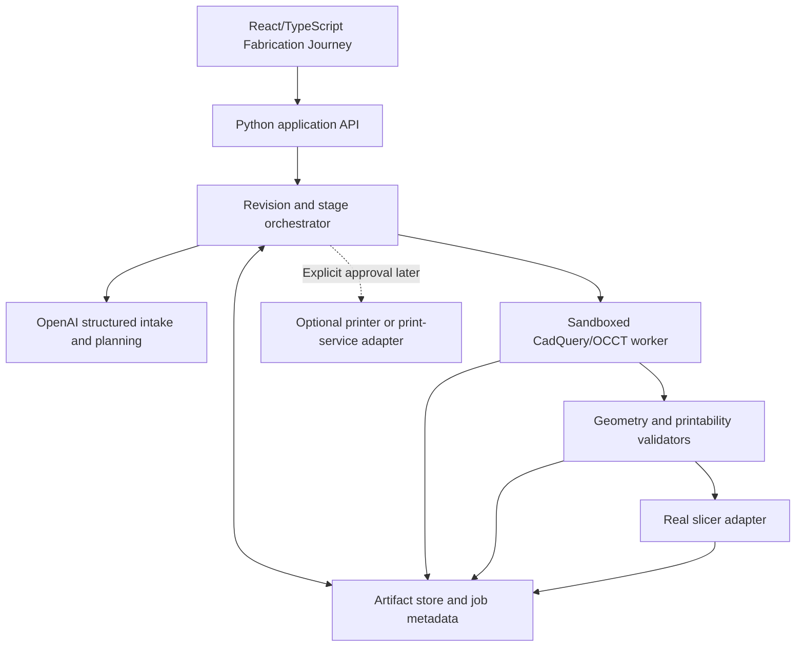

# Architecture

## Architectural goal

Keep the user experience, orchestration, CAD execution, deterministic verification, slicing, and optional hardware integration separated by versioned contracts. The system must remain useful without a printer or paid 3D-generation provider.

## Target system



The first implementation remains a modular monolith: one Python application with isolated worker boundaries and a separate browser frontend. Separate network services are introduced only when deployment or safety requires them.

## Fabrication lifecycle

| Stage | Purpose | Required exit evidence |
|---|---|---|
| Brief | Turn the request into an explicit specification | Valid schema; assumptions and unresolved questions recorded; user confirmation where material |
| Design | Create editable parametric geometry | Source executes; valid solid exported; expected features exist |
| Geometry validation | Measure the produced body | Kernel validity, dimensions, topology, wall and clearance findings |
| Printability validation | Evaluate a proposed manufacturing orientation | Bed fit, wall/nozzle rules, overhangs, supports, holes, material/profile compatibility |
| Slicing | Produce a manufacturing toolpath with a real slicer | Slicer exit success, profile provenance, layer/toolpath summary, G-code preflight |
| Fabrication package | Collect reproducible artifacts and evidence | Complete manifest, reports, source, geometry, preview, slicer project, and checksums |
| Manufacturing | Optional physical handoff and observation | Explicit approval, adapter-specific safety checks, telemetry, and physical result record |

A failed validation creates a finding and a new design revision. It does not mutate or erase the prior revision.

## Stage state model

A stage may be:

- `waiting`
- `running`
- `needs_input`
- `passed`
- `passed_with_warnings`
- `failed`
- `cancelled`
- `superseded`

Progress reports concrete events rather than invented percentages. Examples include `spec_validated`, `cad_kernel_completed`, `step_exported`, `wall_check_completed`, and `slicer_completed`.

## Core records

### Job

The durable user goal and its revision history.

### Revision

An immutable attempt derived from a confirmed specification and parent revision. Changes produce a new revision with a reason and a diff.

### PartSpec

The versioned manufacturing intent. It includes:

- Purpose and part family.
- Units, dimensions, datums, tolerances, and critical features.
- Mating components and clearances.
- Loads, force directions, environment, and expected lifetime.
- Material and process preferences.
- Printer envelope, nozzle, orientation, support, and surface constraints.
- Fasteners, inserts, purchased components, and assembly method.
- Safety class, assumptions, unresolved questions, and provenance.

### StageRun and StageEvent

`StageRun` stores the state, attempts, timing, tool identity, findings, and artifact references. `StageEvent` is the append-only stream used by the Fabrication Journey.

### Artifact

An immutable file plus media type, role, checksum, producer, version, and lineage.

### Finding

A deterministic or model-assisted observation with severity, evidence, affected geometry, remediation, and resolution state.

### Decision and Approval

A recorded choice and its rationale. An approval is required before a consequential boundary such as accepting unresolved risk or dispatching physical hardware.

## Artifact contract

Each revision receives its own directory:

```text
runs/<job-id>/revisions/<revision-id>/
|-- request.txt
|-- cad_request.json
|-- cad_result.json
|-- cad_worker.stdout.log
|-- cad_worker.stderr.log
|-- design/
|   |-- part_spec.json
|   |-- expected.json
|   |-- parameters.json
|   |-- design.py
|   |-- part.step
|   |-- part.3mf
|   |-- preview.glb
|   |-- compatibility.stl
|   |-- geometry_validation.json
|   `-- cad_environment.json
|-- profiles/
|   |-- printer.json
|   |-- material.json
|   |-- process.json
|   |-- orientation.json
|   |-- prusaslicer.ini
|   `-- bundle.json
|-- printability/
|   |-- policy.json
|   |-- oriented.step
|   `-- report.json
|-- slicing/
|   |-- slicer_installation.json
|   |-- model_info.*.log
|   |-- project.*.log
|   |-- slice.*.log
|   |-- slicer_project.3mf
|   |-- toolpath.gcode
|   |-- gcode_preflight.json
|   `-- slice_report.json
|-- fabrication/
|   `-- package.json
|-- journey.json
`-- manifest.json
```

This is the implemented M3 package. Design artifacts remain unchanged when later stages materialize orientation, snapshot profiles, assess R3, slice, preflight, and package the revision. `journey.json` and `manifest.json` are generated package indexes rather than entries in their own manifest, avoiding self-referential checksums.

An artifact is absent when its stage did not complete. Placeholder artifacts must identify themselves as fixtures and must never be mixed with production evidence.

## Simulation and visualization

The interface distinguishes:

1. **Workflow replay:** stage events, revisions, decisions, and artifacts.
2. **Design inspection:** dimensions, cross-sections, feature highlights, and revision differences.
3. **Manufacturing simulation:** real G-code layer/toolhead playback with slicer estimates.
4. **Engineering simulation:** later FEA/thermal/fluid analysis with explicit assumptions and an experimental evidence label.
5. **Physical observation:** printer telemetry, photographs, measurements, and failures.

Toolpath playback is not structural or thermal proof.

## Technology direction

| Concern | Initial choice | Notes |
|---|---|---|
| Domain and workers | Python 3.11 | Matches the existing package and CadQuery ecosystem |
| CAD | CadQuery backed by OCCT | Functional lane; source is a first-class artifact |
| API | FastAPI on the existing Python domain | M4-A implements a loopback-only, read-only filesystem boundary; job execution and streaming remain later |
| Browser interface | Vite + React + TypeScript | M4-M implements journey evidence, bounded revision discovery/pages, bounded persisted-file snapshots, verified artifact delivery, strict persisted lifecycle/scalar/time/root/report/profile/schema/lineage/package/content-identity contracts, direct Three.js preview, worker-owned toolpath playback, generated API response types, bounded persisted-evidence selection, server-owned revision comparison, and tested keyboard/contrast/reduced-motion foundations |
| Model integration | OpenAI Responses API with strict structured output and function tools | Model output cannot bypass deterministic gates |
| Slicing | Adapter over PrusaSlicer and/or OrcaSlicer CLI | Profiles and tool versions are recorded |
| Metadata | SQLite initially | Filesystem stores large artifacts; migration path remains open |
| Optional control plane | Go later if justified | Suitable for a printer-side agent or deployment service, not required for CAD |

Dependencies are not considered installed merely because they appear in this target table.

## Provider boundaries

- `IntentProvider`: request and context to proposed `PartSpec` plus clarification questions.
- `CadProvider`: confirmed `PartSpec` to editable source and exact geometry.
- `GeometryValidator`: geometry and specification to deterministic findings.
- `PrintabilityValidator`: oriented geometry, material, and printer profile to findings.
- `SlicerProvider`: geometry plus versioned profiles to slicer project and G-code.
- `PrinterAdapter`: approved package to adapter-specific preflight, upload, start, and telemetry.

Each provider must have a deterministic fixture for tests and must report whether it is real, simulated, or unavailable.

## Security and safety boundaries

- Generated CAD code runs with time, memory, filesystem, process, and network restrictions.
- API keys stay on the server and are never embedded in browser assets or artifacts.
- Untrusted mesh/CAD inputs receive size and complexity limits.
- Final G-code comes only from an approved slicer adapter.
- Printer adapters default to disconnected and read-only.
- Remote start is disabled until explicit safety requirements are implemented and approved.
- A simulated adapter cannot claim that a person replaced filament, cleared an obstruction, or made any other physical intervention.

## Current implementation mapping

M3 implements one complete printer-independent Golden Part path through R4, and M4-A through M4-M expose its persisted records through a read-only application slice:

- `domain/spec.py` implements immutable `PartSpec` 1.0.0 and design-readiness rules.
- `domain/journey.py` implements jobs, immutable revisions and records, append-only events, artifact lineage, and manifests.
- `domain/lifecycle.py` implements and tests the accepted seven-stage transition model.
- `fabrication_contracts.py` owns the dependency-light ordered 19-role production-package contract shared by the R4 writer and read-boundary validator.
- `orchestrator.py` executes the Brief gate and labels a complete confirmed result R0.
- `schemas/v1/` contains 19 allowlisted persisted contracts: PartSpec, StageEvent, ArtifactManifest, printer-independent FabricationPackage, explicitly non-evidentiary interface-package fixture, and separate production/interface-fixture geometry, printability, preflight, printer, material, process, and orientation schemas. The canonical interface OpenAPI contract is stored beside them but is not a persisted-instance schema.
- `benchmarks/golden_part/` freezes the first exact specification and R2 measurement targets.
- `benchmarks/golden_part/printability_expected.json` freezes the R3 profile selection, deterministic rules, warning dispositions, and claim boundary.
- `benchmarks/3dbenchy/` preserves the official checksum-pinned CC0 calibration fixture and provenance without treating it as functional-CAD qualification.
- `profiles/v1/` contains versioned printer, material, process, orientation, and PrusaSlicer configuration artifacts.
- `cad/contracts.py` defines immutable, versioned worker request, result, and artifact descriptors without importing CadQuery.
- `cad/runner.py` invokes a separate process with a timeout, environment allowlist, confined paths, immutable run files, artifact checksum verification, and quarantine on integrity failure.
- `cad/worker.py` accepts only the registered hand-authored Golden Part provider, schema-validates the complete geometry report before publication, publishes atomically, and records exact tool versions and honest boundary limitations.
- `cad/golden_part_design.py` is the standalone editable parametric source copied into every successful revision.
- `cad/validation.py` queries the re-imported STEP through OCCT and evaluates 25 frozen feature, clearance, and dimensional checks.
- `cad/stl.py`, `cad/glb.py`, and `cad/canonical.py` verify compatibility topology, write/inspect the browser preview, and remove volatile exporter metadata used in reproducibility hashes.
- `cad/pipeline.py` advances the Golden Part journey through Design R1 and Geometry Validation R2, records 15 artifacts and lineage edges, and persists the journey and manifest.
- `slicing/profiles.py` strictly parses and schema-validates the four production profile contracts before typed construction, then validates them against the exact PrusaSlicer INI so metadata cannot drift silently from executable settings.
- `slicing/printability.py` materializes a centered Z-up STEP, applies exact profile, volume, bed-contact, wall/feature, layer, overhang, bounded-bridge, support, orientation, and first-layer-clearance checks without importing CadQuery into the lightweight path, and schema-validates the complete report before publication.
- `slicing/prusaslicer.py` invokes one approved local PrusaSlicer executable, records model repairs and warnings, schema-validates disconnected preflight before publication, and exports a real profile-bearing 3MF project plus G-code without hardware access.
- `slicing/gcode.py` parses real G-code and applies disconnected profile-specific checks for units, modes, bounds, temperatures, tools, support features, layer height, and forbidden commands.
- `slicing/pipeline.py` advances the same revision through R3, R4 slicing, and package completeness; snapshots all profiles; records every command/log/checksum/lineage edge; and fails closed under the frozen repair/warning policy.
- `api/bounded_io.py` captures one local file snapshot with an explicit maximum and optional expected size, reading no more than the accepted ceiling plus one byte and distinguishing missing, unreadable, oversized, and size-mismatched inputs.
- `schema_validation.py` resolves allowlisted source or wheel-installed Draft 2020-12 schema assets, caps each trusted schema at 1 MiB, rejects malformed/duplicate/non-finite schema JSON, meta-validates it, applies strict timezone-aware date-time checks, and bounds error text derived from untrusted records. `jsonschema` is therefore a core read-boundary dependency rather than test-only tooling.
- `api/repository.py` discovers revisions through non-symlink-following directory scans capped at 5,000 examined entries and 500 observed candidates, sorts by job/revision ID, and loads at most the selected 200-summary page. It exposes incomplete discovery, observed omissions, live-page non-snapshot semantics, and filesystem errors rather than claiming an exact total. Detail reads load revision-scoped journeys, optional manifests and packages through 32 MiB/200,000-node/depth-32 bounded snapshots; reject duplicate keys, non-finite constants, scalar coercion, unsupported lifecycle/evidence vocabularies, inconsistent stage terminal state, ownership drift, duplicate local/global event sequences, reversed job/revision/stage/event/approval/manifest chronology, fixture/runtime mixing, enabled hardware flags, and manifest decision/approval drift; enforce committed PartSpec/event/manifest/package schemas; require exhaustive stage-owned record coverage, unique artifact paths, acyclic chronological lineage, and package-stage/19-role/descriptor/warning/G-code/report-snapshot parity; confine artifact paths; capture artifact bytes once under a 64 MiB ceiling; verify that snapshot against recorded size/SHA-256; parse only known report/profile roles through 2 MiB/20,000-node/depth-16 snapshots and exact role schemas; cross-check production package profile IDs, geometry descriptors, benchmark, preflight, and packaged PartSpec content; and delegate normalized revision diffs without mutation. Unsupported inspection schemas become explicit unavailable records, direct inspection-artifact downloads repeat applicable semantic validation, and revision listings intentionally skip detail-artifact parsing.
- `api/models.py` publishes API 1.7.0 with enum-backed job/stage/event/finding/decision/approval/package/report/profile/evidence fields, literal-false hardware capabilities, and explicit date-time formats for exposed timestamps, so generated browser types cannot widen lifecycle values or enabled hardware state and contract tooling can identify temporal fields.
- `api/comparison.py` computes deterministic semantic diffs over normalized persisted stages, requirements, features, reports, checks, findings, profiles, artifacts, and package state. It omits generated IDs/timestamps, enforces record/change/value ceilings, and never reruns an evidence-producing stage.
- `api/app.py` exposes loopback-only health, bounded revision-list, revision-detail, revision-comparison, and verified-snapshot artifact routes while advertising `hardware_actions: false` in every application contract. Revision offset/page-size constraints fail at HTTP validation before discovery; binary, 404, integrity-conflict, and size-limit responses are explicit in OpenAPI.
- `api/openapi.py` deterministically generates and checks the committed OpenAPI snapshot without reading journey data; runtime documentation/schema routes remain disabled.
- `api/fixture.py` deterministically generates the committed `benchmarks/interface/` family. Every stage is labelled `fixture`; complete parent/child, `needs_input`, failed Geometry, failed Printability, and incomplete Package journeys stop at their persisted gate.
- `web/` contains the Vite React/TypeScript client, shipment-style timeline, warning and claim presentation, bounded observed-revision pages with incomplete/non-snapshot disclosure, artifact links, fixture boundary, bounded Three.js GLB inspection, worker-owned G-code layer playback, a selectable feature/check/finding/profile/artifact evidence explorer, a persisted revision picker/diff view, generated OpenAPI response aliases, semantic landmarks and keyboard tabs, route title/focus handling, non-color status cues, live reduced-motion handling, contrast regression checks, real-artifact integration tests, lint/type checks, and production build. The Three.js renderer owns only a dedicated empty canvas host; React retains ownership of loading/error overlays.
- `.github/workflows/ci.yml` defines lightweight backend and frontend checks, including canonical OpenAPI and generated-TypeScript drift gates. The approximately 1 GiB CAD/slicer environment remains a separate full verification path.
- `experiments/slicer_benchmark/` compares official 3DBenchy and the conventional warship under the same real slicer/profile while earning no Golden Part evidence.
- `model_gen.py` creates a cuboid STL fixture.
- `mesh_validate.py` performs basic ASCII STL checks.
- `slicer.py` writes demonstration perimeter G-code.
- `gcode_validate.py` checks basic bounds and temperatures.
- `klipper_api.py` is a simulator.

The older fixture CAD, slicer, and printer modules are not connected to the evidence-gated Golden Part path and do not advance its evidence level. Only `slicing/prusaslicer.py` through `slicing/pipeline.py` can provide the current R4 slicer evidence, and that path has no printer adapter or hardware action.

The M2 worker is an isolation boundary for registered repository source, not a hardened sandbox for arbitrary generated Python. Network denial, enforceable memory/process limits, and stronger OS-level confinement remain mandatory before any untrusted CAD code can execute.
