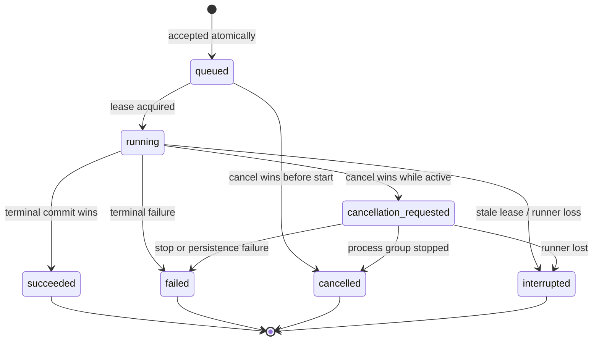

# No-hardware execution contract

**Contract version:** 1.1.0

**Policy version:** 1.0.0

**Status:** Implemented as schemas, immutable records, lifecycle operations, an internal transactional SQLite store, a sealed R2/R4 registry, Windows Job supervision, exact-path/SHA-256 Python bootstrap, and real R2/R4 pipeline adapters. CAD and all three PrusaSlicer commands launch-reverify accepted identity, suppress command-shell probing, and run under frozen process/log/memory/deadline/cancellation policy plus D-036 workspace monitoring; slicer export commands force four threads. The existing pipelines persist R2 and R4 evidence. Filesystem isolation, network denial, store/Journey event coordination, mutation/SSE endpoints, and browser controls remain unavailable.

## Purpose

This contract defines how Ariad may later execute its existing deterministic Golden Part pipeline from the local application. It exists before the runner so queueing, cancellation, crashes, resource limits, and identity cannot be improvised inside an HTTP handler.

The contract is deliberately narrower than the CLI:

- only `opengrow_stake_electronics_clamp_v1` is admitted;
- the only targets are `golden_part_r2` and `golden_part_r4`;
- the requester cannot supply a filesystem path, CAD provider, profile, slicer, executable, command, environment, or hardware option;
- every request, record, and event states that hardware actions are false;
- success means only that the requested software evidence gate was reached;
- no printer is selected, contacted, heated, moved, uploaded to, or started.

The current `ariad --golden-part` and `--golden-part-r2` commands remain direct synchronous developer commands. They do not satisfy this job-runner contract merely because they can produce R2 or R4 evidence.

## Admission order

A future adapter must perform admission in this order:

1. Accept one JSON object no larger than 16 KiB and validate `execution-request.schema.json` without scalar coercion or undeclared fields.
2. Require a local authenticated capability. For a browser request, require JSON-only content, an exact loopback/same-origin policy, and an unpredictable anti-CSRF capability tied to the application process. Loopback binding alone is not CSRF protection.
3. Resolve the target through the fixed registry. Never accept caller-selected paths, providers, profiles, executables, or commands.
4. Before accepting a record, verify every required dependency and snapshot the exact input identities. R4 admission must reject if the approved slicer is absent, has the wrong identity, or the required resource policy cannot be enforced. A rejected admission does not create a plausible failed evidence run.
5. In one store transaction, resolve the idempotency key, check the one-active/four-queued limits, allocate a monotonic accepted sequence, and persist the queued record plus `request_accepted` event.

The canonical request is UTF-8 JSON with sorted keys and no insignificant whitespace. Its SHA-256 is stored with the request.

### Idempotency

- Same key and byte-equivalent canonical request: return the original execution, regardless of its status.
- Same key and different canonical request: return an idempotency conflict; never mutate or replace the original.
- New key with four waiting executions: reject as queue full.
- Accepted executions use their persisted `accepted_sequence` for FIFO order. Filesystem order and client timestamps never choose the next job.

## Immutable execution identity

Identity is snapshotted before acceptance and must be re-verified against that immutable plan immediately before launch. It is never silently rebound midway through a run.

| Identity | R2 | R4 |
|---|---:|---:|
| Benchmark and registered provider | Required | Required |
| CAD worker version | Required | Required |
| CAD provider source SHA-256 | Required | Required |
| dependency-lock SHA-256 | Required | Required |
| Ariad application source/schema bundle SHA-256 | Required | Required |
| CPython 3.11 patch version and active executable SHA-256 | Required | Required |
| Curated CPython runtime tree and manifest SHA-256 | Required | Required |
| Traced locked-dependency environment tree SHA-256 | Required | Required |
| Windows system/release/version/machine snapshot | Required | Required |
| CadQuery 2.8.0 and OCP 7.9.3.1.1 identities | Required | Required |
| PartSpec SHA-256 | Required | Required |
| geometry expectations SHA-256 | Required | Required |
| printability expectations SHA-256 | Forbidden | Required |
| printability validator and fabrication-pipeline versions | Forbidden | Required |
| printer/material/process/orientation IDs and SHA-256 values | Forbidden | Required |
| composite slicer-config SHA-256 | Forbidden | Required |
| slicer adapter ID/version and PrusaSlicer 2.9.6 executable SHA-256 | Forbidden | Required |
| PrusaSlicer portable archive, manifest, and complete installation-tree SHA-256 | Forbidden | Required |

Paths are intentionally absent from the persisted request and plan. A trusted adapter may resolve repository-owned assets and the approved executable, but their accepted content identities cannot change after queue admission. A mismatch at launch fails closed rather than silently rebinding the plan.

M4-P implements that resolution through `TrustedTargetRegistry`. Its public resolver accepts only `golden_part_r2` or `golden_part_r4`; every path, profile, provider, executable, and manifest location is selected internally. It validates fixed benchmark/profile SHA-256 approvals, the current Ariad source/schema tree, exact locked distributions, the curated CPython runtime, traced dependency files and startup hooks, `pyvenv.cfg`, and the active 64-bit Windows host. R4 additionally verifies the separately pinned PrusaSlicer release archive and every file in the approved portable installation. `RegisteredTargetAdmission` resolves only genuinely new idempotency keys and preserves replay/conflict access to the immutable original even if today's toolchain has drifted.

The CAD dependency manifest is intentionally trace-derived: it records the exact files observed while the registered R4 Python lane succeeds, and it is bound to the current Ariad application-bundle hash. This is reproducibility and drift evidence, not process-confinement evidence. Until the adapter enforces an import allowlist, sanitized environment, and OS policy, it has not proved that an unmanifested module can never load. The host snapshot detects release/version/machine drift but does not content-hash Windows system DLLs.

## State model

Execution status is separate from a Journey stage status. The execution record owns scheduling and process lifecycle; persisted `StageRun` records continue to own fabrication evidence.

Terminal records are immutable. There is no transition from `cancellation_requested` to `succeeded`, and there is no automatic resume from `interrupted`.

### Cancellation linearization

Cancellation and completion must contend on the same transactional execution row:

- if terminal completion commits first, a later cancel returns the unchanged terminal record;
- if queued cancellation commits first, the execution becomes `cancelled` without ever starting;
- if active cancellation commits first, the record becomes `cancellation_requested`, no next stage may start, and the execution can no longer succeed;
- the runner requests cooperative shutdown, then terminates the complete process tree after the ten-second grace ceiling;
- snapshots, logs, artifacts, findings, and Journey events already persisted are retained. Cancellation never rolls back or deletes evidence.

The cancellation endpoint is idempotent. Repeated cancellation does not rewrite timestamps or emit duplicate semantic events.

## Concurrency, leases, and crash recovery

- At most one execution is active globally.
- At most four executions wait in the FIFO queue.
- Starting a queued record and acquiring its lease is one transaction.
- A lease lasts 30 seconds and the owner heartbeats every 10 seconds.
- The lease records acquisition, latest heartbeat, and an expiry exactly 30 seconds after that heartbeat.
- `runner_instance_id` plus `generation` is a fencing identity. Every active identity bind, stage/event persistence transaction, heartbeat, and terminal commit must present the matching unexpired fence. A different owner, generation, or stale runner cannot renew or commit success.
- On startup, an active record whose lease has expired becomes `interrupted` with a `runner_interrupted` failure. It is not silently resumed or rerun.
- A user may submit a new idempotency key after reviewing an interrupted run. The new execution has a new identity and retains lineage to its own output only.

The first store uses Python's standard-library SQLite with transactional rows for executions, idempotency keys, leases, and append-only events. Large Journey artifacts remain in revision directories. SQLite is a control-plane index, not an alternate source of fabrication evidence.

M4-O implements the store behind `ExecutionControlStore`; M4-P advances it to schema 2 so the expanded 1.1.0 plan identity is persisted exactly. No schema-1 migration is offered because no HTTP mutation surface or production control database existed. The store uses an Ariad application ID, WAL mode with `synchronous=FULL`, strict tables, immutable metadata, exact DDL fingerprints, startup integrity/foreign-key checks, canonical JSON and SHA-256 replay, a separate immutable accepted-plan hash, and database triggers for queue, active-run, transition, append, ownership, timestamp, counter, and terminal-state invariants. Every operation revalidates the schema before reading or mutating control state.

Record JSON is capped at 256 KiB. Individual stored event JSON is capped at 128 KiB and total event JSON at 8 MiB per execution. The store preserves the frozen 10,000-event ceiling while reserving one slot and one maximum-sized event for a terminal failure, cancellation, success, or interruption. List reads return no more than 100 record values without allocating every history; full snapshots and event replay remain bounded. Concurrent initialization is serialized with a bounded WAL retry, and stale leases are reconciled transactionally before the next FIFO start.

This is integrity and crash-consistency evidence for an application-owned local database, not a cryptographic audit log. A privileged local actor that can rewrite the database and its schema is outside the checksum threat model. Terminal records are deliberately retained for idempotency, so global archival, total-database disk policy, and emergency terminal-write capacity still need an operational design before browser mutation is enabled.

## Frozen resource policy

These are admission and runtime requirements for the future adapter, not claims about the present synchronous wrappers.

| Limit | Frozen value | Current enforcement |
|---|---:|---|
| Request body | 16 KiB | Schema/request object is bounded; no mutation endpoint exists |
| Total execution wall time | 900 s | Not yet enforced as one deadline |
| CAD process time | 120 s | Existing wrapper has a blocking timeout; cooperative cancellation is absent |
| Each slicer command | 180 s | Existing wrapper has a blocking timeout; cooperative cancellation is absent |
| Cancellation grace | 10 s | Store rejects premature `cancellation_timeout`; no process cancellation exists |
| Lease / heartbeat | 30 s / 10 s | Store enforces acquisition, fencing, renewal, expiry, and interruption; no heartbeat loop exists |
| Persisted events | 10,000 per execution | Store enforces append order, 8 MiB aggregate JSON, and terminal slot/byte reserves |
| Event data | 64 KiB, depth 16, 20,000 nodes, 32 top-level fields | Enforced by the event record |
| Each stdout or stderr stream | 8 MiB | Not yet enforced; existing capture can grow without this bound |
| Execution workspace | 512 MiB | Enforced for sealed R2/R4 targets by bounded polling, immediate Job termination, and a final scan under D-036; temporary overshoot remains possible |
| Active process-tree memory | 4 GiB | Not yet enforced by the operating system |
| Concurrent child processes | 1 per execution | Not yet enforced as an OS process-tree limit |
| Slicer threads | 4 | Existing default agrees; accepted runner must force it |
| Network | Denied | Intent only today; no OS-level denial yet |
| Hardware actions | Denied | No printer adapter is present in the approved path |
| Automatic resume | Denied | Store interrupts expired active records and has no resume transition; no runner exists |

The HTTP adapter must remain unavailable until it can enforce every limit needed for the selected target. A timeout passed to `subprocess.run` is not proof of bounded logs, process-tree termination, memory confinement, or network denial.

## Event log and future SSE projection

Execution events are persisted append-only and use a monotonic sequence from 1 through 10,000. Event type and execution status combinations are closed by schema. Events may report exact facts such as stage name, check count, layer count, artifact ID, or byte count; `progress_percent` is forbidden because the pipeline has no defensible continuous percentage model.

A future Server-Sent Events endpoint is only a projection of the persisted log:

- persist an event before broadcasting it;
- use the persisted sequence as the SSE `id`;
- reconnect with `Last-Event-ID` and return later persisted events in sequence order;
- delivery is at least once, so clients deduplicate by execution ID and sequence;
- keepalive comments are transport details and are not persisted events;
- disconnecting a browser never cancels an execution;
- queue position is an observation, not stable evidence, and must not be presented as a percentage;
- a terminal record has one matching terminal event. If event persistence and terminal-state persistence cannot commit atomically, the terminal state must not be published.

## Failure taxonomy

Every failed or interrupted execution uses a closed structured failure:

| Code | Meaning |
|---|---|
| `dependency_unavailable` | An accepted dependency disappeared or became unreadable after admission |
| `input_integrity_failed` | A snapshotted input no longer matches its accepted identity |
| `worker_timeout` | CAD or slicer exceeded its permitted deadline |
| `resource_limit` | Log, workspace, memory, event, or process ceiling was reached |
| `stage_failed` | The deterministic pipeline rejected a stage |
| `persistence_failed` | Control state or immutable evidence could not be committed safely |
| `cancellation_timeout` | The process tree did not stop within the cancellation grace period |
| `runner_interrupted` | The runner disappeared and its lease expired |
| `internal_error` | A bounded unexpected runner error |

Failure stages may name only Brief through Fabrication Package. `manufacturing` is invalid because this runner has no physical stage. Messages are capped at 512 characters; detailed logs belong in bounded artifacts. `retryable` is advice for a human decision, never permission for automatic retry.

## Persistence and artifact rules

- Execution records and events validate against the committed Draft 2020-12 schemas before persistence and after replay.
- The request hash, plan, policy, status transition, lease, failure, and event append are transactionally consistent. Every active write checks the current owner, generation, and expiry in the same transaction.
- The Journey remains the source of stage, finding, decision, artifact, and evidence claims.
- The control store may bind `job_id` and `revision_id` once the pipeline materializes them. Rebinding to another identity is forbidden.
- Stage snapshots are published atomically through the existing Journey persistence path before a corresponding execution event is appended.
- Partial revision directories are retained and remain subject to the read API's existing fail-closed integrity checks.
- G-code remains an R4 artifact produced by the approved slicer. This contract cannot dispatch it.

## What must exist before browser execution

The GET-only API and read-only browser remain unchanged until all of these are implemented and tested:

1. [x] A transactional SQLite control store with idempotency, FIFO admission, event sequences, leases, and startup reconciliation. M4-O implements it internally and keeps it unreachable from HTTP.
2. [x] A target registry that snapshots and re-verifies all R2/R4 identities before acceptance and launch. M4-P implements acceptance and explicit `reverify`; the future adapter must call it at launch.
3. [x] The registered CAD worker and every R4 PrusaSlicer command run through Windows Job supervision with cancellable process-tree execution, bounded stdout/stderr, one shared execution deadline, per-command ceilings, launch-time accepted-plan re-verification, and deterministic descendant cleanup.
4. [~] Aggregate memory and active-process limits are enforced by the Windows Job Object. D-036 permits bounded polling plus a final workspace scan. Python imports use exact hashes, command-shell probing is suppressed, and slicer exports force four threads. Filesystem isolation and network denial remain incomplete.
5. [ ] Atomic Journey snapshot and execution-event coordination with retained partial evidence.
6. [ ] Adapter-level recovery, cancellation-race, resource-exhaustion, and crash-injection tests. Store-level admission, race, rollback, stale-lease, corruption, and concurrent-open tests already pass.
7. [ ] JSON-only same-origin mutation authentication plus an anti-CSRF capability.
8. [ ] Versioned POST/cancel/SSE OpenAPI contracts and generated browser types.
9. [ ] A browser control that exposes queue, cancellation, failure, and claim boundaries without invented progress.
10. [ ] The existing read, CAD, slicer, packaging, frontend, wheel, and live HTTP gates continuing to pass after the adapter is connected.

Until then, `schemas/v1/execution-*.schema.json` and `ariad_fabrication.execution` are a tested contract, registry, admission path, and internal control store—not a working background job service.
